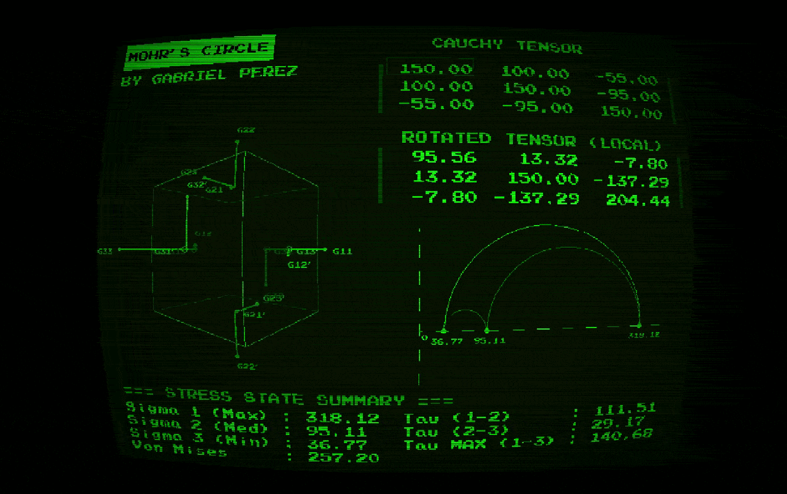

Cauchy Stress Tensor and Mohr's Circle Visualizer 🚀

An interactive, real-time 3D visualizer developed in C++ to explore the Stress Tensor and Mohr's Circle.

This project was born as a study initiative to make the abstract concepts of solid mechanics more intuitive by combining linear algebra with graphics programming and a retro green phosphor monitor (CRT) aesthetic.



✨ Main Features:

* Iterative Solver (Jacobi Algorithm): The mathematical engine of the project uses the Jacobi method to diagonalize the stress matrix. This allows for the efficient and real-time calculation of eigenvalues and eigenvectors (principal stresses and their directions) as well as the Von Mises yield criterion.
* Robust 3D Rotation: Manipulation of the differential volume element in 3D space using Quaternions and spherical linear interpolation (SLERP), ensuring smooth movements and eliminating the Gimbal Lock problem.
* Stress Representation: Axial and shear stresses of the rotated differential volume element.
* Mohr's Circle: Automatic and synchronized generation of the 2D diagram based on the updated tensor data.
* Retro Aesthetic (CRT): Implementation of a custom shader that applies barrel distortion and luma attenuation to emulate the look of classic terminals.

🛠️ Tech Stack:

* Language: C++17.
* Mathematics: Eigen3 for advanced matrix manipulation.
* Graphics: olcPixelGameEngine for fast pixel rendering and user interface management.

⚙️ Compilation and Installation:

To run this project locally, you need a C++17 compatible compiler and to configure the paths to Eigen3.

* Prerequisites:
    GCC, Clang, or MSVC.
    Eigen3 header-only library.
* Standard olcPixelGameEngine dependencies (OpenGL, libpng, etc., depending on your OS).

Example compilation on Linux : 
```bash
g++ -o visualizador main.cpp -std=c++17 -O3 -I/path/to/your/eigen/folder -lX11 -lGL -lpthread -lpng -lstdc++fs
```

🎮 How to Use:

Launch the compiled application.
Input or modify the stress matrix values ($\sigma_{xx}$, $\tau_{xy}$, etc.) via the interface.

The Jacobi solver will instantly process the matrix to update the principal stresses. Rotate the differential cube in the 3D environment and observe how the stress states change correspondingly with the 2D Mohr's Circle.

👨‍💻 Project Context:

I developed this visualizer as a student with the goal of bringing together three areas of interest: Solid Mechanics, Linear Algebra, and Computer Graphics from scratch. Instead of using heavy game engines, the core of this project was to understand and apply the Jacobi algorithm to solve real physical problems in an interactive visual environment.

## 📚 Technical Documentation

This project includes detailed documentation of the architecture, classes, and functions automatically generated with Doxygen.

To view it locally:

Navigate to the html/ folder in the root directory of the project.

Open the index.html file in any web browser.
